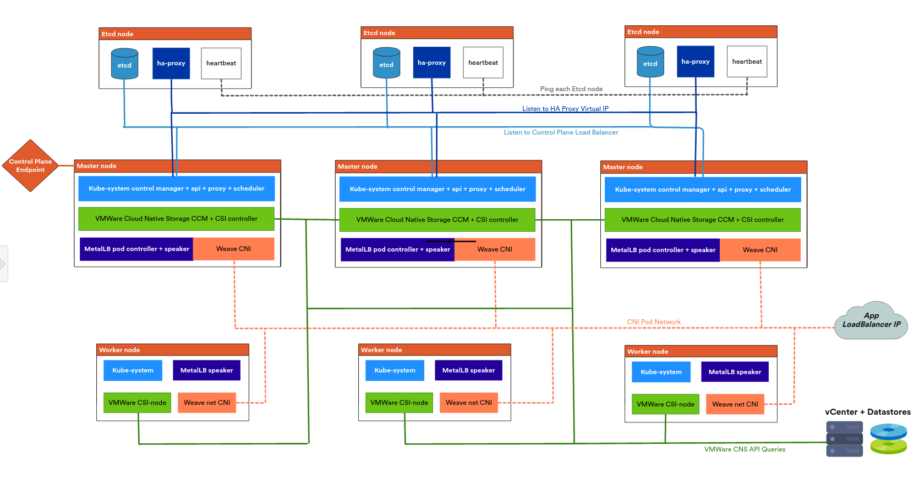

```
#!/usr/bin/env bash
apt update
apt install software-properties-common
apt-add-repository --yes --update ppa:ansible/ansible
apt install ansible
ansible-galaxy collection install -r requirements.yaml
pip install pyvmomi
wget https://cloud-images.ubuntu.com/bionic/current/bionic-server-cloudimg-amd64.ova -O /tmp/ubuntu-18.04-server-cloudimg-amd64.ova
export ANSIBLE_HOST_KEY_CHECKING=False
ansible-playbook -i hosts cluster.yaml
```


